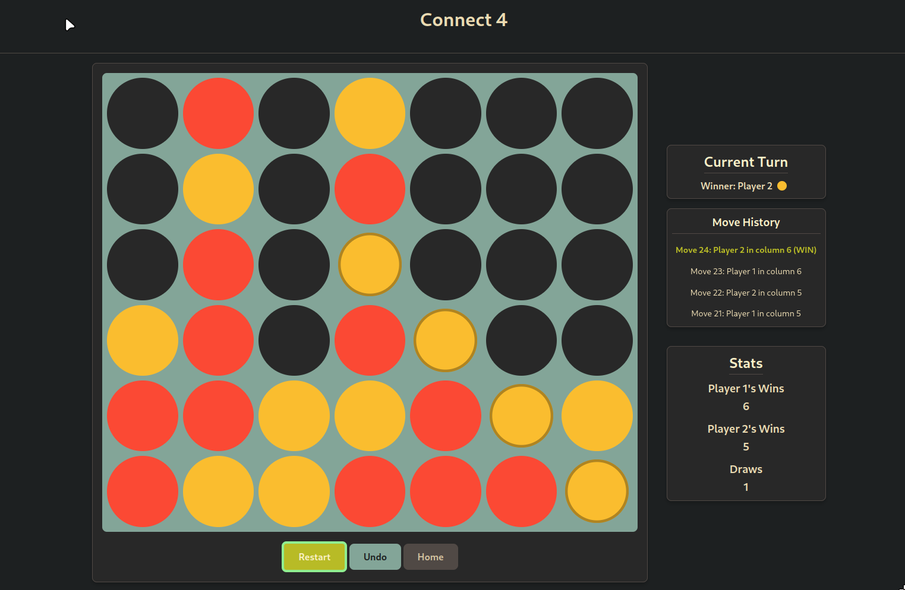

# Connect 4 Game

A Connect 4 game featuring customizable settings, game history tracking, and responsive design for both desktop and mobile devices.



## Table of Contents

- [Features](#features)
- [Getting Started](#getting-started)
  - [Prerequisites](#prerequisites)
  - [Installation](#installation)
- [How to Play](#how-to-play)
- [Game Controls](#game-controls)
- [Customization](#customization)
- [Technical Details](#technical-details)
- [Project Structure](#project-structure)
- [Future Enhancements](#future-enhancements)
- [Contributing](#contributing)
- [License](#license)

## Features

- **Responsive Design**: Play on desktop or mobile devices with intuitive controls
- **Customizable Settings**:
  - Player names and token colors
  - Board dimensions (4x4 up to 10x10)
  - Board color
- **Game History**:
  - Track and review moves during gameplay
  - Hover/hold on history items to preview the board state at that point
  - Click/tap to return to a previous state in the game
- **Statistics Tracking**: Persistently records wins for each player and draws
- **Visual Feedback**:
  - Animated winning pieces
  - Hover effects for column placement
  - Visual highlights for game state changes
- **Undo Functionality**: Revert moves, including undoing wins and draws
- **Keyboard Controls**: Use number keys to place tokens in columns

## Getting Started

### Prerequisites

- A modern web browser (Chrome, Firefox, Safari, Edge)
- A web server for local development (optional)

### Installation

1. Clone the repository:
   ```bash
   git clone https://github.com/Pineapple-Pineapple/connect4.git
   cd connect4
   ```

2. Run the game:
   - **Using a local server**:
     ```bash
     # Using Python
     python -m http.server
     
     # Using Node.js
     npx serve
     ```

3. Visit the appropriate URL (e.g., `http://localhost:8000`)

## How to Play

Connect 4 is a two-player strategy game where players take turns dropping colored tokens into a vertical grid. The goal is to be the first to form a horizontal, vertical, or diagonal line of four tokens.

### Game Controls

#### On Desktop:
- Click on any column to drop your token
- Hover over a column to see a preview of where your token will land
- Use number keys (1-9, 0) to drop tokens in the corresponding columns

#### On Mobile:
- Tap on any column to drop your token
- Swipe across columns to preview placements

### Move History
- **On Desktop**: Hover over a move in the history to see a preview of the board at that point
- **On Mobile**: Tap and hold a move in the history to see a preview

## Customization

Before starting a game, you can customize:

- **Player Names**: Enter custom names for each player
- **Player Colors**: Choose custom colors for each player's tokens
- **Board Size**: Set the number of rows (4-10) and columns (4-10)
- **Board Color**: Change the background color of the game board

All settings and statistics are saved automatically in your browser's local storage.

## Technical Details

This Connect 4 implementation is built using modern vanilla JavaScript with a modular architecture:

- **No external dependencies**: Pure HTML, CSS, and JavaScript
- **ES6+ features**: Classes, modules, private fields
- **MVC-like architecture**: Separation of game logic, UI, and settings
- **Local Storage**: Persistent settings and statistics
- **Responsive design**: Adapts to different screen sizes and touch interfaces

## Project Structure

```
connect4/
├── css/
│   └── style.css        # Main stylesheet
├── js/
│   ├── connect4.js      # Core game logic
│   ├── controller.js    # Game controller
│   ├── main.js          # Application initialization
│   ├── settings.js      # Settings management
│   └── ui.js            # UI management
├── index.html           # Main game page
├── help.html            # Help documentation
└── README.md            # This documentation
```

### Key Components:

- **Connect4**: Core game logic that handles game state, move validation, win detection
- **GameController**: Coordinates between game logic, settings, and UI
- **UIManager**: Manages visual presentation and user interaction
- **SettingsManager**: Handles settings storage and retrieval
- **GameApp**: Main application that initializes and connects all components

## Future Enhancements

Here are some planned features and improvements:

- **Better Codebase**: Add more classes (EventEmitter, Component, etc) and restructure code
- **AI Opponent**: Single-player mode with adjustable difficulty levels
- **Game Themes**: Additional visual themes beyond color customization
- **Sound Effects**: Audio feedback for game actions
- **Animation Improvements**: Enhanced token drop animations
- **Game Replay**: Save and replay entire games
- **Responsive Improvements**: Better experience on very small screens
- **Accessibility Enhancements**: Better keyboard controls and screen reader support

## Contributing

Contribute if you want! Here's how you can contribute:

1. Fork the repository
2. Create a feature branch: `git checkout -b new-feature`
3. Commit your changes: `git commit -m 'feat: add new feature'`
4. Push to the branch: `git push origin new-feature`
5. Submit a pull request

Please ensure your code follows the existing style and includes appropriate comments.

## License

This project is licensed under the MIT License - see the [LICENSE](LICENSE) file for details.
